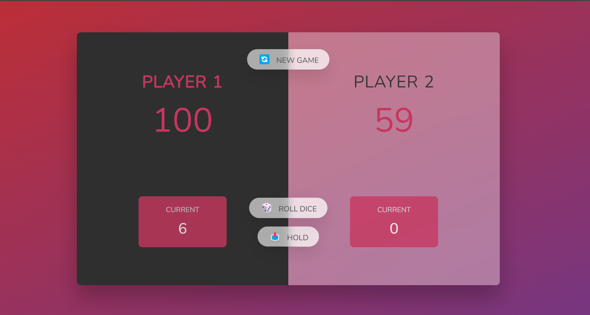

# Pig Game

## Table of Contents

- [Introduction](#introduction)
- [Preview](#preview)
- [Features](#features)
- [Installation](#installation)
- [Usage](#usage)
- [Contributing](#contributing)
- [License](#license)

## Introduction

This repository contains the code for a simple Pig Game, a two-player dice game. Players take turns rolling a dice and accumulating points, with the goal of reaching a predefined score to win.

## Preview



## Features

- Two-player game
- Rolling dice functionality
- Player scores and current scores are displayed
- Winning player is highlighted

## Installation

1. Clone the repository to your local machine.
   ```bash
   git clone https://github.com/fkayensu/pig-game.git
   ```

## Usage

1. Open the `index.html` file in a web browser.
2. Click the "Roll Dice" button to roll the dice and accumulate points.
3. Click the "Hold" button to add the current score to your total score.
4. The game switches to the next player if a 1 is rolled.
5. The first player to reach a predefined score of 100 or more wins.

## Contributing

If you would like to contribute to the project, feel free to open issues or submit pull requests!.
